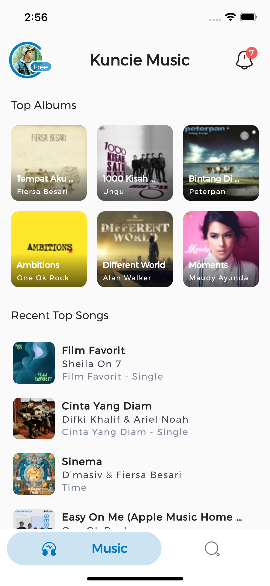
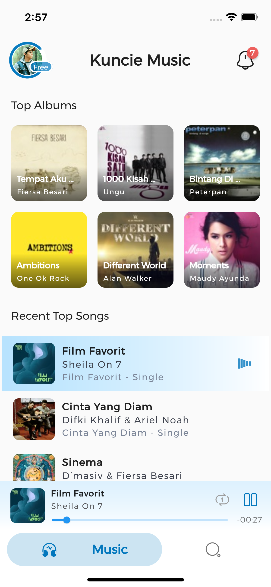
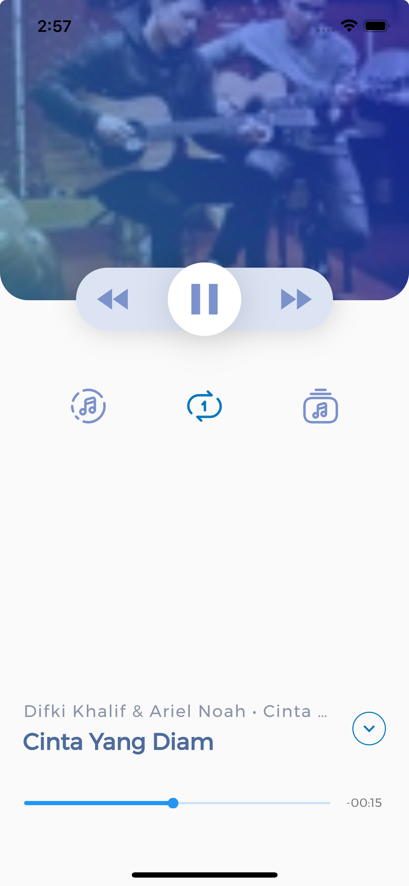
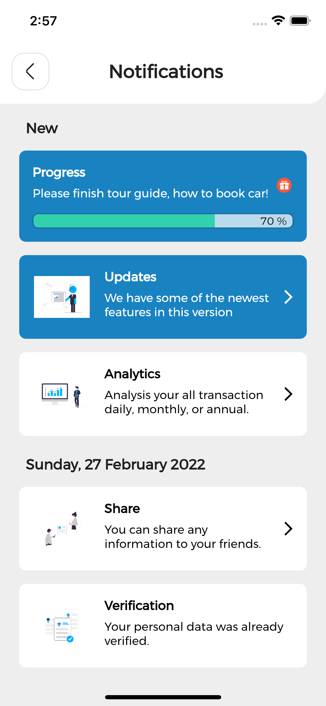
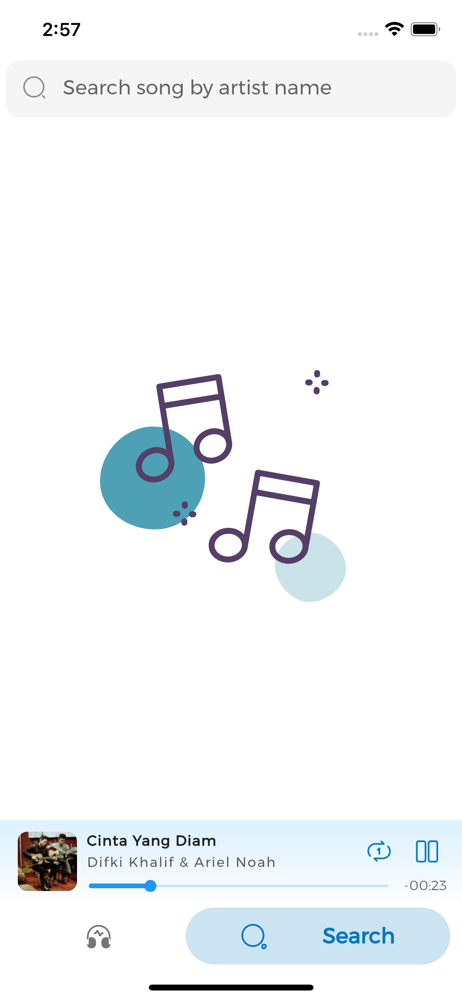
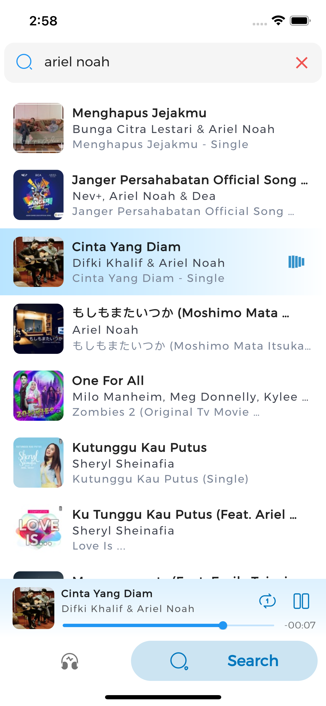

# Kuncie Apple Music

A new Flutter project using iTunes API for Music Player.

## Getting Started for Flutter

This project is a starting point for a Flutter application.

A few resources to get you started if this is your first Flutter project:

- [Lab: Write your first Flutter app](https://flutter.dev/docs/get-started/codelab)
- [Cookbook: Useful Flutter samples](https://flutter.dev/docs/cookbook)

For help getting started with Flutter, view our
[online documentation](https://flutter.dev/docs), which offers tutorials,
samples, guidance on mobile development, and a full API reference.

## Try It with Demo Application

<div>
<a href='#'></a>
<a href='#'></a>
</div>

## The Sceenshots of Application

 <span width="10%"><span>  <span style="width:5%"><span> 
  

## Supported Devices (OS)

To find out if your device is compatible with the app, check the list of supported devices (OS) :

- iOS Mobile App : iOS Version 9.0 (Monarch) & above
- Android Mobile App : Android 4.4 KitKat (API level 19) & above
- Web App (Mobile Size-Mode) : Chrome 84 & above
- MacOX Desktop App (Mobile Size-Mode) : macOS Sierra 10.12.2 & above
<!-- - Windows Desktop App (Mobile Size-Mode) : Windows 7 & above -->

## Supported Features

This music player app is supported by the amazing features.

- [x] Browse albums and songs then play music with selecting song.
- [x] Search song by artist name then play music with selecting song.
- [x] Play music with run in the background or with the screen turned off.
- [x] Music controls available : Play, Pause, Stop, Seek (Progress Indicator), Fast (Rewind & Forward) and Repeat One Song. 
- [x] When tap a song, a media player should show up at the bottom of the screen and start to play the preview for that song.
- [x] Music controls interacting with headset buttons, the Android lock screen and notification, iOS control center, wearables, AndroidAuto (CarPlay) or smart watch.

## Requirements to Build The App

### [Get the Flutter SDK](https://docs.flutter.dev/get-started/install)

Download the following installation bundle to get the latest stable release of the Flutter SDK, see : https://docs.flutter.dev/get-started/install.

For other release channels, and older builds, see the SDK releases page : https://docs.flutter.dev/development/tools/sdk/releases.

### System Requirements

To install and run Flutter, your development environment must meet these minimum requirements and IDE software:

#### [MacOS](https://docs.flutter.dev/get-started/install/macos)
- [x] <strong>Operating Systems</strong>: macOS
- [x] <strong>Disk Space</strong>: 2.8 GB (does not include disk space for IDE/tools).
- [x] <strong>IDE Software</strong>: [Visual Studio Code](https://code.visualstudio.com/download), [Android Studio](https://developer.android.com/studio) (or [IntelliJ](https://www.jetbrains.com/idea/download/)), and [Xcode](https://itunes.apple.com/us/app/xcode/id497799835).
- [x] <strong>Tools</strong>: Flutter uses `git` for installation and upgrade. We recommend installing [Xcode](https://developer.apple.com/xcode/), which includes `git`, but you can also [install git separately](https://git-scm.com/download/mac).

#### [Windows](https://docs.flutter.dev/get-started/install/windows)
- [x] <strong>Operating Systems</strong>: Windows 7 SP1 or later (64-bit), x86-64 based.
- [x] <strong>Disk Space</strong>: 1.64 GB (does not include disk space for IDE/tools).
- [x] <strong>IDE Software</strong>: [Visual Studio Code](https://code.visualstudio.com/download) and [Android Studio](https://developer.android.com/studio) (or [IntelliJ](https://www.jetbrains.com/idea/download/)).
- [x] <strong>Tools</strong>: Flutter depends on these tools being available in your environment. [Windows PowerShell 5.0](https://docs.microsoft.com/en-us/powershell/scripting/install/installing-windows-powershell) or newer (this is pre-installed with Windows 10). [Git for Windows 2.x](https://git-scm.com/download/win), with the Use <strong>Git from the Windows Command Prompt</strong> option.

#### [Linux](https://docs.flutter.dev/get-started/install/linux)
- [x] <strong>Operating Systems</strong>: Linux (64-bit)
- [x] <strong>Disk Space</strong>: 600 MB (does not include disk space for IDE/tools).
- [x] <strong>IDE Software</strong>: [Visual Studio Code](https://code.visualstudio.com/download) and [Android Studio](https://developer.android.com/studio) (or [IntelliJ](https://www.jetbrains.com/idea/download/)).
- [x] <strong>Tools</strong>: Flutter depends on these command-line tools being available in your environment, like : `bash` `curl` `file` `git 2.x` `mkdir` `rm` `unzip` `which` `xz-utils` `zip`.
- [x] <strong>Shared libraries</strong>: Flutter test command depends on this library being available in your environment. `libGLU.so.1` - provided by mesa packages such as `libglu1-mesa` on Ubuntu/Debian and `mesa-libGLU` on Fedora.

#### [Chrome OS](https://docs.flutter.dev/get-started/install/chromeos)
- [x] <strong>Operating Systems</strong>: Chrome OS (64-bit) with [Linux (Beta)](https://support.google.com/chromebook/answer/9145439) turned on
- [x] <strong>Disk Space</strong>: 600 MB (does not include disk space for IDE/tools).
- [x] <strong>IDE Software</strong>: [Visual Studio Code](https://code.visualstudio.com/download) and [Android Studio](https://developer.android.com/studio) (or [IntelliJ](https://www.jetbrains.com/idea/download/)).
- [x] <strong>Tools</strong>: Flutter depends on these command-line tools being available in your environment, like : `bash` `curl` `git 2.x` `mkdir` `rm` `unzip` `which` `xz-utils`.
- [x] <strong>Shared libraries</strong>: Flutter test command depends on this library being available in your environment. `libGLU.so.1` - provided by mesa packages such as `libglu1-mesa` on Ubuntu/Debian.


### Flutter & Tools Version
>Flutter 2.10.2
>Tools • Dart 2.16.1
>Tools • Android SDK 31.0.0
>Tools • CocoaPods 1.11.2

### Flutter Packages Dependency

Dependencies are one of the core concepts of the [pub package manager](https://dart.dev/guides/packages). A dependency is another package that your package needs in order to work. Dependencies are specified in your [pubspec](https://dart.dev/tools/pub/pubspec). You list only <i>immediate dependencies</i> — the software that your package uses directly. Pub handles [transitive dependencies](https://dart.dev/tools/pub/glossary#transitive-dependency) for you.

#### State Management, Route Management, Dependency Injection, & Utility 

- [x] [get](https://pub.dartlang.org/packages/get) : It combines high-performance state management, intelligent dependency injection, and route management quickly and practically.
- [x] [intl](https://pub.dartlang.org/packages/intl) : Provides internationalization and localization facilities, including message translation, plurals and genders, date/number formatting and parsing, and bidirectional text.
- [x] [url_strategy](https://pub.dartlang.org/packages/url_strategy) : Package for Flutter apps that allows setting the web URL strategy with a single line of code. To remove the leading hash (#) from the URL of your Flutter web app.
- [x] [url_launcher](https://pub.dartlang.org/packages/url_launcher) : A Flutter plugin for launching a URL. Supports iOS, Android, web, Windows, macOS, and Linux.

#### Audio Services

- [x] [just_audio](https://pub.dartlang.org/packages/just_audio) : A feature-rich audio player for Flutter. Loop, clip and concatenate any sound from any source (asset/file/URL/stream) in a variety of audio formats with gapless playback.
- [x] [just_audio_libwinmedia](https://pub.dartlang.org/packages/just_audio_libwinmedia) : Libwinmedia implementation of just_audio for windows & linux. This implementation is endorsed and therefore doesn't require a direct dependency.
- [x] [audio_service](https://pub.dartlang.org/packages/audio_service) : Flutter plugin to play audio in the background while the screen is off.

#### Images Asset & Library

- [x] [lottie](https://pub.flutter-io.cn/packages/lottie) : Lottie is a mobile library for Android and iOS that parses Adobe After Effects animations exported as json with Bodymovin and renders them natively on mobile.
- [x] [cached_network_image](https://pub.flutter-io.cn/packages/cached_network_image) : A flutter library to show images from the internet and keep them in the cache directory.
- [x] [transparent_image](https://pub.flutter-io.cn/packages/transparent_image) : A simple transparent image. Represented as a Uint8List, which was originally extracted from the Flutter codebase (was private in the test package).

#### Fonts & Icons

- [x] [google_fonts](https://pub.dartlang.org/packages/google_fonts) : The google_fonts package for Flutter allows you to easily use any of the thousands of fonts available from fonts.google.com in your Flutter app.
- [x] [iconsax](https://pub.dartlang.org/packages/iconsax) : Iconsax for flutter (1000+ icons 6 diferent styles, total 6000+ icons). the official icons of the Vuesax framework.
- [x] [font_awesome_flutter](https://pub.dartlang.org/packages/font_awesome_flutter) : The Font Awesome Icon pack available as set of Flutter Icons.

#### Animations & Elements

- [x] [flutter_animated_dialog](https://pub.dartlang.org/packages/flutter_animated_dialog) : A new Flutter dialog with a series of beautiful animations, slide fade rotate size scale rotate3D animations. Dialog barrier include status bar at the top of screen, solved the problem of default dialog.
- [x] [flutter_spinkit](https://pub.dartlang.org/packages/flutter_spinkit) : A collection of loading indicators animated with flutter. Heavily inspired by @tobiasahlin's SpinKit.
- [x] [fade_shimmer](https://pub.dartlang.org/packages/fade_shimmer) : A fade shimmer library to implement loading like latest facebook loading effect.
- [x] [badges](https://pub.dartlang.org/packages/badges) : A flutter package for creating badges. Badges can be used for an additional marker for any widget, e.g. show a number of items in a shopping cart.
- [x] [step_progress_indicator](https://pub.dartlang.org/packages/step_progress_indicator) : Bar indicator made of a series of selected and unselected steps
- [x] [liquid_pull_to_refresh](https://pub.dartlang.org/packages/liquid_pull_to_refresh) : A beautiful and custom refresh indicator with some cool animations and transitions for flutter.


### [iTunes Search API](https://affiliate.itunes.apple.com/resources/documentation/itunes-store-web-service-search-api)

#### Overview

The Search API allows you to place search fields in your website to search for content within the iTunes Store and Apple Books Store. You can search for a variety of content; including books, movies, podcasts, music, music videos, audiobooks, and TV shows. You can also call an ID-based lookup request to create mappings between your content library and the digital catalog. Developers may use promotional content in the API, including previews of songs, music videos, album art and App icons only to promote store content and not for entertainment purposes. Use of sound samples and other assets from the API must be proximate to a store badge. Terms and conditions apply.

The Partners Program allows you to earn a commission on qualifying revenue generated by clicks initiated from your website or app into the iTunes Store and Apple Books Store. For more information on the Partners Program, see http://www.apple.com/itunes/affiliates.

#### Searching

To search for content from a field in your website and display the results in your website, you must create a search field that passes a fully-qualified URL content request to the iTunes Store, parse the JavaScript Object Notation (JSON) format returned from the search, and display the results in your website, 
see : https://affiliate.itunes.apple.com/resources/documentation/itunes-store-web-service-search-api.

## File & Folder Structure

There are two files and five different folders. Each of them has own specific function.

### Files
1) **main.dart**: It is the main file of applications developed using the Flutter SDK.
2) **core.dart**: This is the library mechanism that will export all library each of **xcore,dart** file in ordert to make simple and clean code when import library.

### Folders
1) **api**: Contains providers and repositories for handle API communication from webservice or restful API.
2) **app**: Contains the pure GetX State Management for implement business logic, presentation logic and UI widget with **controllers** and **views**. And also intelligent dependency injection with **bindings**
3) **models**: Generated models and serializers from JSON that contains data on any variable and collections.
4) **routes**: Contains the pure GetX Route Management for navigation between pages.
5) **shared**: Contains configuration with constants, utilities, extentions, theme style, popup dialogs, and global widgets for the Flutter project.

## Instructions to Build and Deploy The App

### Set Up & Running

#### 1. Clone The Github Repo

```bash
$ git clone https://github.com/faisalramdan17/kuncie_music.git
$ cd kuncie_music
```

#### 2. Running The App

```bash
flutter run
```

#### 3. Automated Unit Testing

```bash
flutter test
```

### Build and Deploy the App

During a typical development cycle, you test an app using `flutter run` at the command line, or by using the **Run** and **Debug** options in your IDE. By default, Flutter builds a debug version of your app.

When you’re ready to deploy or prepare a release version of your app, this Instructions can help:

#### [Android App](https://docs.flutter.dev/deployment/android)

#### [iOS App](https://docs.flutter.dev/deployment/ios)

#### [MacOS App](https://docs.flutter.dev/deployment/macos)

#### Windows App

#### [Linux App](https://docs.flutter.dev/deployment/linux)

#### [Web App](https://docs.flutter.dev/deployment/web)

flutter build ios

flutter build apk


flutter build web


## Solving Errors

There are several potential errors when run or debug this music player app and you can find the some solutions how to fix it.

###  XMLHttpRequest (API Cors) Error in Flutter Web

It seems like `CORS error` is well-known issue in the web field. But it could be critical error. The error message is usually something like : 

```
Access to XMLHttpRequest at 'https://itunes.apple.com' from origin 'http://localhost:59269' has been blocked by CORS policy: The 'Access-Control-Allow-Origin' header has a value 'http://localhost:60893' that is not equal to the supplied origin.
```

You can check forum discusing at stackoverflow.com by clicking this link :
https://stackoverflow.com/questions/65630743/how-to-solve-flutter-web-api-cors-error-only-with-dart-code/66879350

In order to make the process easier I highly recommend to use `flutter_cors` Dart Package.
Check this link : https://pub.dev/packages/flutter_cors

#### 1. Install `flutter_cors` Dart Package.

```bash
dart pub global activate flutter_cors
```

#### 2. Set Paths

```bash
export PATH="$PATH":"$HOME/.pub-cache/bin"
```

#### 3. Run `flutter_cors` for disable CORS

```bash
fluttercors --disable
```

## Support Me
- Subscribe → https://bit.ly/flutter-free-course
- Download My Apps → https://codingyourlife.gumroad.com
- PayPal → https://www.paypal.com/paypalme/faisalramdan17
- Buy Me a Coffee → https://www.buymeacoffee.com/faisalramdan17
- My Portfolio on Codecanyon → https://codecanyon.net/user/codingyourlife/portfolio

## About Me
- Email → faisalramdan.id@gmail.com
- Website → https://codingyourlife.id
- Youtube → https://bit.ly/flutter-free-course
- GitHub → https://github.com/faisalramdan17
- Contact us on Telegram → https://t.me/faisalramdan17
- Facebook → https://www.facebook.com/codingyourlife.id
- Instagram → https://instagram.com/faisalramdan17 & https://instagram.com/codingyourlife.id
- LinkedIn → https://www.linkedin.com/in/faisalramdan17

Thanks so much!